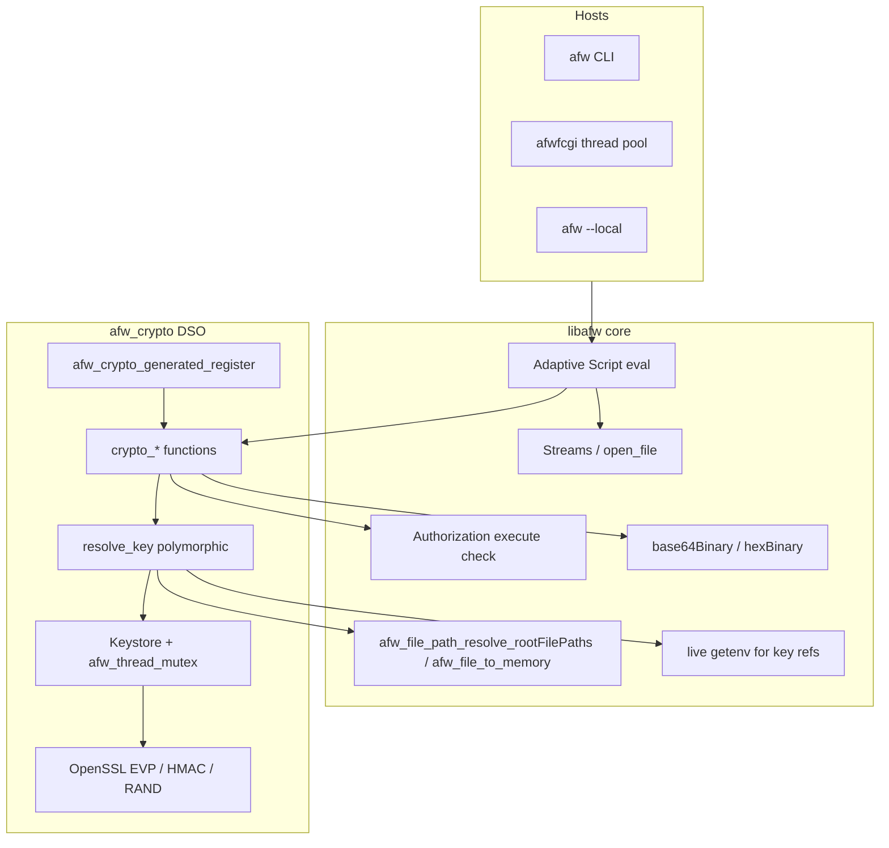
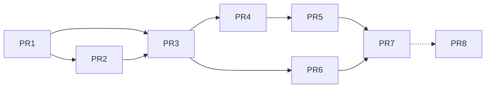

# Design: Secrets-friendly I/O and `afw_crypto` Extension (Issue #74 remainder)

| Field | Value |
|-------|--------|
| **Title** | Secrets-friendly Adaptive Script I/O and `afw_crypto` extension |
| **Author** | TBD (design draft for maintainer review) |
| **Date** | 2026-07-30 |
| **Status** | Draft (accepted decisions for name, #74 stay-open, PBKDF2) |
| **Tracking** | GitHub [issue #74](https://github.com/afw-org/afw/issues/74) (partially done; stays open until readpass); related notes in `whats-new.md`, `beta-backlog.md` |
| **Primary deliverable path** | Workspace: `designs/secrets-and-afw-crypto.md`. Long-term with extension: `src/afw_crypto/doc/design-secrets-and-crypto.md` plus a short pointer from `src/afw/doc/developer/extending.md` if useful. |
| **Audience** | AFW maintainers and senior C/Python contributors familiar with extensions, function generate metadata, and Adaptive Script |
| **Revision** | R4 — final product decisions: name `afw_crypto`/`libafwcrypto` confirmed; #74 remains open until readpass ships (crypto = partial progress); PBKDF2 default 600000 (pin at implement time) |

---

## Overview

Issue #74 asked for two Adaptive Script enhancements: (1) access to process `args` and related process identity, and (2) a mechanism to read or decrypt sensitive data such as passwords. Part (1) is **already shipped** on `mgg-develop` via `process::` / `/afw/_AdaptiveProcess_/current` and ambient `environment::` at environment create. Part (2) remains open; the original idea of interactive `read`/`readpass` is a weak centerpiece for a multi-host runtime (`afw`, `afwfcgi`, `afw --local`).

This design **reframes delivery priority** for the remaining #74 work around **composition** (see **K17**): secrets already live in files (`open_file` + `read_to_base64Binary`), process environment (live `getenv` for key refs), conf templates, and adapters/objects. What scripts lack is a small, correct **cryptographic primitive surface** so ciphertext can be stored “in plain sight” and decrypted at use time. That surface belongs in a new optional loadable extension **`afw_crypto`** / **`libafwcrypto`** (name **confirmed**), backed by **OpenSSL libcrypto** (OpenSSL 3.x on supported Ubuntu builds; headers/`libcrypto` via distro packages), independent of `afw_curl`.

**#74 closure (final):** shipping crypto + key refs is **partial progress** on #74 and should be noted on the tracker, but **issue #74 stays open until interactive readpass also ships** (PR8) or is explicitly declined in a future decision. Crypto is not the sole exit criterion.

The design keeps **`password` as a presentation data type**, treats interactive non-echo input as a **required remaining #74 piece** (deprioritized for implementation order, not dropped from closure), and models keys in a **Web Crypto–inspired** way: opaque key handles, separate import, normative algorithm identifiers, and binary in/out via `base64Binary` and `hexBinary` (both accepted where documented).

---

## Background & Motivation

### Issue #74 status and product reframe

| Item | Tracker / code status | This design’s stance |
|------|------------------------|----------------------|
| `process::args`, `programName`, `pid`, `cwd`, `afwVersion`, `startTime` | **Done** (partial #74) | Out of scope for implementation PRs |
| `environment::` ambient at env create | **Done** (#71/#74) | Out of scope; note snapshot vs live `getenv` for key refs below |
| Interactive `read` / `readpass` | Residual for #74 closure | **Still required for #74 closure** — implement as PR8 (TTY/`afw` CLI); deprioritized relative to crypto but **keeps #74 open** until it ships or is explicitly declined later |
| Decrypt / crypto primitives | **Missing** (no encrypt/decrypt/digest/hmac functions) | **Primary near-term delivery** — ships first as **partial #74 progress**; does **not** close the issue alone |

**Product decision (K17 — final):** Keep **#74 open** until interactive **readpass** also ships (or a future decision explicitly declines it). Ship `afw_crypto` + composition (key refs) as **valuable partial progress** and update tracker/docs accordingly; do **not** close #74 on crypto alone. Residual for closure is interactive **readpass** (GitHub #74 + `whats-new.md` / this design).

### Current capabilities (verified against `/workspaces/afw`)

**Streams & files**

- `open_file(streamId, path, mode, autoFlush?)` resolves logical paths via application `rootFilePaths` (longest prefix; no path escape). Marked `requiresExecuteAccess: true`.
- Public APIs implementers must use for file key refs: **`afw_file_path_resolve_rootFilePaths`** and **`afw_file_to_memory`** (`src/afw/file/afw_file.h`) — already used by `open_file` / `compile_from_file`. **No new core path API required.**
- `read` / `readln` / `read_to_base64Binary` / `read_to_hexBinary` operate on stream numbers.
- Standard streams: `stdout`, `stderr`, `console`, `response_body`, `raw_response_body`. **No stdin stream.**

**Binary & random**

- `base64Binary` and `hexBinary` (`afw_memory_t` internal).
- `random_*` uses `apr_generate_random_bytes`. Crypto key/IV generation uses OpenSSL **`RAND_bytes`**.

**Password data type**

- `src/afw/generate/objects/_AdaptiveDataTypeGenerate_/password.json` + utf8 impl in `afw_data_type.c` with FIXME (“Should password be raw or encoded?”).
- Presentation-oriented; not hashing/encryption.

**Extensions & authz**

- No crypto DSO among `afw_curl` / `ldap` / `lmdb` / `ubjson` / `vfs` / `yaml`.
- `afw_curl` does not call EVP; only CURLOPT SSL options.
- `requiresExecuteAccess: true` → `afw_function_execute_requiresExecuteAccess_wrapper` → `afw_authorization_check`. **When `authorizationControl` is NULL, the check is bypassed** (same as `open_file` / `http_get`). Authz-off deployments have no per-function gate beyond “extension loaded.”
- Extension `release()` is rarely/never called (curl comment: not currently called).

**Concurrency**

- `afwfcgi` runs a **request-thread pool** (concurrent requests, per-request xctx). Process-global tables require locking via **`afw_thread_mutex_*`** (`afw_thread.h` / APR mutex macros).

**Build environment**

- Docs install `libssl-dev` / `libcurl4-openssl-dev` (`src/afw/doc/building_on_linux.md`).
- This workspace: OpenSSL **3.0.2**, `openssl/evp.h`, link `-lcrypto`. libsodium not present. Prefer **header + library discovery** over fragile pkg-config version wording.

### Pain points

1. Scripts can read secret-bearing bytes but cannot decrypt or MAC-verify without shelling out or custom C.
2. Interactive `readpass` only helps TTY `afw`; useless for `afwfcgi` and batch.
3. Env-only or path-only secret APIs fight multi-source composition.
4. OpenSSL in **core** would force dependency on every host.

---

## Goals & Non-Goals

### Goals

1. Advance the **secrets remainder of #74** via decrypt/compose (`afw_crypto` + key refs) as **partial progress**; full #74 close still requires readpass (K17).
2. Ship optional **`afw_crypto`** / **`libafwcrypto`** with a small Web Crypto–inspired surface and a **normative algorithm registry**.
3. Keys as **material and/or references** (env live `getenv`, rootFilePaths file, material object).
4. Compose with streams, objects, conf; reuse **`afw_file_path_resolve_rootFilePaths`** / **`afw_file_to_memory`**.
5. OpenSSL **libcrypto** only; no `afw_curl` dependency.
6. Explicit **security defaults**: mutexed keystore, random keyIds, size limits, cleanse rules, authz-leak guidance.
7. Incremental PR plan with shared key-resolution early.
8. Clarify **`password`** presentation vs crypto.

### Non-Goals

1. Full secrets manager / KMS / HSM / Vault.
2. Interactive `readpass` as the *primary* multi-host secrets architecture (it remains a #74 closure item via PR8, not the crypto design center).
3. Crypto in core libafw.
4. Full SubtleCrypto (RSA/EC/JWK/wrapKey) in v1.
5. Further `process::` work.
6. Sealed compiler value types.
7. Full password-type FIXME fix (doc only optional).
8. JS browser crypto polyfill.
9. Multi-tenant cryptographic isolation inside one process (documented non-goal; see K13/K14).
10. Stream/progressive crypto for multi-GB payloads (v1 is single-buffer with size caps).

---

## Proposed Design

### High-level architecture



### Package / srcdir layout

```text
src/afw_crypto/
  afw_crypto.h
  afw_crypto_extension.c
  afw_crypto_internal.h/.c     # keystore+mutex, resolve_key, size limits, cleanse
  afw_crypto_function_crypto.c
  cmake/OpenSSLCryptoConfig.cmake
  CMakeLists.txt
  generate/
    manifest/manifest.json
    objects/
      _AdaptiveFunctionCategory_/crypto.json
      _AdaptiveFunctionGenerate_/crypto_*.json
      _AdaptiveObjectType_/_AdaptiveCryptoKey_.json
      _AdaptiveObjectType_/_AdaptiveCryptoEncryptResult_.json
      _AdaptiveObjectType_/_AdaptiveCryptoSealed_.json   # optional docs for file layout
  tests/
    config.py
    crypto_*.as
    vectors/
  doc/
    design-secrets-and-crypto.md
    README.md
```

**`afw-package.json`:**

```json
"afw_crypto": {
  "brief": "Library libafwcrypto",
  "buildType": "afwmake",
  "description": "AFW shared object - libafwcrypto (OpenSSL-backed crypto functions).",
  "optionalChoiceDefault": true,
  "prefix": "afw_crypto_",
  "produces": "libafwcrypto",
  "srcdirPath": "src/afw_crypto"
}
```

### CMake / OpenSSL linkage (normative)

Mirror **curl/yaml** hand-written find modules — **not** CMake FindOpenSSL (unused in-repo today).

`cmake/OpenSSLCryptoConfig.cmake` (sketch):

```cmake
if(OpenSSLCrypto_FOUND)
  return()
endif()

find_path(OpenSSLCrypto_INCLUDE_DIR openssl/evp.h)
find_library(OpenSSLCrypto_LIBRARY NAMES crypto)

if(NOT OpenSSLCrypto_INCLUDE_DIR OR NOT OpenSSLCrypto_LIBRARY)
  message(FATAL_ERROR "libcrypto (OpenSSL) not found; disable afw_crypto or install libssl-dev")
endif()

set(OpenSSLCrypto_FOUND TRUE)
add_library(OpenSSLCrypto::Crypto IMPORTED INTERFACE)
set_property(TARGET OpenSSLCrypto::Crypto PROPERTY
  INTERFACE_INCLUDE_DIRECTORIES "${OpenSSLCrypto_INCLUDE_DIR}")
set_property(TARGET OpenSSLCrypto::Crypto PROPERTY
  INTERFACE_LINK_LIBRARIES "${OpenSSLCrypto_LIBRARY}")
```

`CMakeLists.txt`:

```cmake
include(generated/afwdev_generated_variables.cmake)
include(generated/basic_afw_project.cmake)
find_package(OpenSSLCrypto NO_MODULE PATHS cmake REQUIRED)
# INTERFACE includes come via link; do not target_include_directories on the imported INTERFACE alone incorrectly
target_link_libraries(${PROJECT_NAME} PRIVATE OpenSSLCrypto::Crypto)
include(generated/basic_afw_install.cmake)
```

Package build: when libcrypto is missing, **skip/disable** the `afw_crypto` srcdir (document as optional component / `optionalChoiceDefault` false override) rather than failing the entire AFW base build. Exact afwdev flag name is implementation detail; document `BUILD_AFW_CRYPTO`-style off switch if cmake packaging needs it.

### Extension initialize / teardown

1. `OPENSSL_init_crypto` as needed for OpenSSL 3 default provider.
2. Create **process-global keystore** + **`afw_thread_mutex_create`** (required, not optional).
3. `afw_crypto_generated_register(xctx)` — PR1 must register at least **`crypto_version_info`** (smoke, like `curl_version_info`).
4. **`release()`**: best-effort cleanse if ever called; **do not rely on it**. Operational cleanup = `crypto_destroy_key` + process exit. Document keys live until destroy or process death.

---

### Design pillars

| Web Crypto idea | AFW mapping |
|-----------------|-------------|
| `SubtleCrypto.encrypt/decrypt` | `crypto_encrypt` / `crypto_decrypt` |
| `importKey` | `crypto_import_key` |
| `CryptoKey` opaque | `_AdaptiveCryptoKey_` with random 64-bit `keyId` into mutexed keystore |
| AlgorithmIdentifier | **Normative registry** below: string *or* object with exact rules |
| BufferSource | **Both** `base64Binary` and `hexBinary` for binary params (no `dataType` in metadata, or documented dual accept via C helper) |
| Digest / HMAC | `crypto_digest`, `crypto_hmac`, `crypto_hmac_verify` |
| Key refs | Convenience on polymorphic `key` / `keySource`; primary path remains import + keyId |

---

### Normative algorithm identifier registry (K14)

**Canonical algorithm `name` strings** (case-sensitive, exact match):

| `name` | Kind | Default key length (bits) | Allowed on |
|--------|------|---------------------------|------------|
| `AES-GCM` | AEAD | **256** (required support); `length` may be `128` or `256` only | encrypt, decrypt, import, generate |
| `SHA-256` | Digest | n/a | digest |
| `SHA-512` | Digest | n/a | digest |
| `HMAC-SHA-256` | MAC | 256 recommended (any length ≥ 16 octets accepted; warn in docs if short) | hmac, hmac_verify, import, generate |
| `HMAC-SHA-512` | MAC | 512 recommended | hmac, hmac_verify, import, generate |
| `PBKDF2` | KDF | output `length` required (octets) | derive_key only |

**Do not use** names like `AES-256-GCM` as algorithm ids. Key size is **`length`** (bits) on AES-GCM, not embedded in the name. (OpenSSL still selects `EVP_aes_256_gcm` vs `EVP_aes_128_gcm` from `length`.)

#### Evaluation rules: string vs object

| Context | Allowed forms | Normalization |
|---------|---------------|---------------|
| `crypto_digest` first arg | **string only** (`SHA-256` / `SHA-512`) | n/a |
| `crypto_hmac` / `crypto_hmac_verify` first arg | **string only** (`HMAC-SHA-256` / `HMAC-SHA-512`) | n/a |
| `crypto_import_key` / `crypto_generate_key` algorithm | **string or object** | string `S` ≡ `{ "name": S }`; object requires `name`; AES-GCM default `length: 256` if omitted |
| `crypto_encrypt` / `crypto_decrypt` algorithm | **object only** (metadata `dataType: object`) | required `name`; see AEAD properties |
| `crypto_derive_key` algorithm | **object only** | `name: "PBKDF2"`, plus KDF properties |

Object form common properties:

```text
{
  "name": string,           // required when object
  "length": integer,        // AES-GCM: 128|256 bits; PBKDF2: output octets
  "iv": binary,             // AES-GCM encrypt optional (auto if omit); decrypt required
  "tag": binary,            // AES-GCM decrypt only (required — see tag rules)
  "additionalData": binary, // AES-GCM optional AAD; if used on encrypt, required identical on decrypt
  "hash": string,           // PBKDF2: "SHA-256" only in v1
  "iterations": integer,    // PBKDF2
  "salt": binary            // PBKDF2
}
```

Unknown `name` → error `error:crypto:unknown_algorithm`.

---

### Binary parameter typing (K15)

Function generate metadata **must not** set `"dataType": "base64Binary"` on parameters that should accept both encodings — parameter evaluation enforces **exact** data type match and will **reject** `hexBinary`.

**Normative rule for all crypto binary inputs** (`data`, `mac`, `iv`, `tag`, `additionalData`, raw key material, salt):

1. **Omit `dataType`** in `_AdaptiveFunctionGenerate_` JSON (untyped / any), **or** document a single internal C helper used everywhere.
2. C helper `afw_crypto_internal_require_binary(value, …)` accepts only:
   - `base64Binary` → use `internal` memory as-is
   - `hexBinary` → use `internal` memory as-is  
   Reject other types with `error:crypto:expected_binary`.
3. **Return types** remain `base64Binary` (stable JSON-friendly default) unless a function documents otherwise.
4. Scripts holding `hexBinary` need not convert before call.

`key` / `keySource` parameters are **untyped** (omit `dataType`) and accepted as polymorphic forms below.

---

### Key model

#### A. Opaque key handle (primary)

```text
crypto_import_key(keySource, algorithm, usages?, extractable?) → object _AdaptiveCryptoKey_
crypto_generate_key(algorithm, usages?, extractable?) → object _AdaptiveCryptoKey_
crypto_export_key(key) → base64Binary    # only if extractable; format raw only in v1
crypto_destroy_key(key) → void
```

**`_AdaptiveCryptoKey_` (script-visible):**

| Property | Type | Notes |
|----------|------|--------|
| `keyId` | integer | **Random 64-bit** id (K13). Capability within process only — forgeable if guessed; not multi-tenant isolation |
| `algorithm` | string | Normalized registry `name` |
| `usages` | array of string | `encrypt`, `decrypt`, `sign`, `verify`, `derive` |
| `extractable` | boolean | Default **`false`** |
| `length` | integer optional | Bit length when known |
| `format` | string | Always `raw` in v1 |

**Do not** expose raw key material on the object when `extractable=false`.

#### Default `usages` when omitted (import / generate / derive)

| Algorithm family (normalized `name`) | Default `usages` if parameter omitted |
|--------------------------------------|----------------------------------------|
| `AES-GCM` | `["encrypt", "decrypt"]` |
| `HMAC-SHA-256`, `HMAC-SHA-512` | `["sign", "verify"]` |
| `PBKDF2` (`crypto_derive_key`) | `["encrypt", "decrypt"]` — suitable for derived AES keys; caller must pass explicit `["sign","verify"]` (etc.) if the derived key is for HMAC |

If caller supplies `usages`, that list is stored as-is (must be non-empty; unknown usage string → `arg_error` / `error:crypto:invalid_usage`).

#### Operation → required usage on CryptoKey (`resolve_key`)

| Operation | `required_usage` string | Notes |
|-----------|-------------------------|--------|
| `crypto_encrypt` | `encrypt` | CryptoKey must list `encrypt` |
| `crypto_decrypt` | `decrypt` | CryptoKey must list `decrypt` |
| `crypto_hmac` | `sign` | Produce MAC |
| `crypto_hmac_verify` | `verify` | Verify MAC (constant-time) |
| `crypto_export_key` | *(none)* | Gated only by `extractable` |
| `crypto_destroy_key` | *(none)* | Any known `keyId` |
| `crypto_derive_key` (on **base** key if CryptoKey) | `derive` | Ephemeral/raw passphrase material skips usage checks |

**Ephemeral raw material** (`base64Binary` / `hexBinary` / reference resolved to octets for a single call): **skip usage checks** — there is no stored usage list. Usage enforcement applies only to keystore `keyId` objects.

Missing required usage on a CryptoKey → `arg_error` with message prefix `error:crypto:usage_not_permitted`.

#### B. Keystore concurrency and limits (K13)

| Rule | Value |
|------|--------|
| Scope | Process-global for loaded extension |
| Locking | **Required** `afw_thread_mutex` around all table ops (import, lookup, destroy, export). Hold lock only for table mutate/lookup; release before long EVP if possible, after copying key material to stack/temp buffer that is cleansed |
| `keyId` | Random 64-bit (`RAND_bytes`), reject 0; collision retry |
| Max keystore entries | **1024** (error `error:crypto:keystore_full`) |
| Max key material size | **8192 octets** per key |
| Multi-tenant | **Not isolated.** Concurrent requests in `afwfcgi` share the keystore. Any script with execute access (or any access when authz off) that learns/guesses `keyId` can use the key. Document “one application identity per process.” |
| Request-scoped cleanup | v1: **not automatic**. Recommend `try`/`finally` + `crypto_destroy_key`. Future: optional xctx-associated keys |
| Extension unload cleanse | Best-effort only; **not reliable** |

#### C. Polymorphic `key` / `keySource` (internal `resolve_key`)

Shared internal API (land by end of PR3):

```c
/* Copies key octets into caller buffer or returns keystore pointer under rules;
 * always OPENSSL_cleanse ephemeral copies on exit paths.
 * required_usage: e.g. "encrypt", "decrypt", "sign", "verify", "derive".
 * If key_value is ephemeral material/ref (not keyId), usage is not checked.
 * If key_value is CryptoKey, keystore entry must list required_usage. */
afw_crypto_resolved_key_t *
afw_crypto_internal_resolve_key(
    const afw_value_t *key_value,
    const afw_utf8_t *required_usage,
    const afw_pool_t *p,
    afw_xctx_t *xctx);
```

**Accepted forms:**

1. **Object with `keyId`** (CryptoKey) — lookup under mutex; **must** include `required_usage` (see operation table above).
2. **`base64Binary` or `hexBinary`** — ephemeral raw material for this call only (not stored); **no usage check**.
3. **Reference object** — resolve to octets then treat as ephemeral; **no usage check**:

| `from` | Required fields | Resolution |
|--------|-----------------|------------|
| `environment` | `name` (string) | **Live `getenv(name)`** (K16) — **not** ambient `environment::` snapshot/preload cache. Decode per `encoding`. Empty/missing → error |
| `file` | `path` (logical) | `afw_file_path_resolve_rootFilePaths` then `afw_file_to_memory` with max size; optional `encoding` if file is text-encoded key |
| `material` | `data` (binary) | Same as form 2 |

Optional common fields: `encoding`: `raw` \| `base64` \| `hex` \| `utf8`.

**Encoding enforcement:**

| `encoding` | Allowed for AES/HMAC raw keys | Allowed for `crypto_derive_key` base key |
|------------|------------------------------|------------------------------------------|
| `raw` / omitted for binary files | yes | yes |
| `base64` / `hex` | yes (decode then use octets) | yes |
| `utf8` | **Hard error** for AES-GCM/HMAC import and for raw material used as AES key | **yes** (passphrase bytes = UTF-8) |

Wrong AES key length after decode → `error:crypto:invalid_key_length` (AES-GCM requires 16 or 32 octets for length 128/256).

**Env/file size limits (K8):**

| Source | Max decoded key octets | On exceed |
|--------|------------------------|-----------|
| environment | 8192 | `error:crypto:key_too_large` |
| file | 8192 | `error:crypto:key_too_large` |
| material / param | 8192 | same |

**Live `getenv` rationale (K16):** Deploy/test harnesses often set env after process start or after env create; ambient `environment::` preloads cache create-time values for known names. Secrets injection must see **current** process environment. Document that this **differs** from `environment::` property semantics for preloaded names. Use careful external/UTF-8 handling when converting C strings to AFW values (follow `afw_value_create_from_external_*` patterns where applicable).

**Deferred `from`:** `object` / `uri`, `qualifier`.

**Passphrase vs key:** Never silently hash UTF-8 into AES. Use `crypto_derive_key` (PR6; **in** the secrets-remainder definition for human passphrases — see PR plan).

#### D. Why material + reference + keyId

- Material: vectors, stream-loaded keys.
- Reference: ops ergonomics.
- Prefer **import once → `keyId`** so authz objects and logs see handles, not master keys, on every encrypt/decrypt.

---

### AES-GCM encrypt / decrypt contract (normative)

#### Encrypt

```text
function crypto_encrypt(
    algorithm: object,   // { name: "AES-GCM", length?: 128|256, iv?: binary, additionalData?: binary }
    key: polymorphic,
    data: binary         // plaintext; base64Binary|hexBinary
): object _AdaptiveCryptoEncryptResult_
```

| Property in / out | Rule |
|-------------------|------|
| `name` | Required: `AES-GCM` |
| `length` | Optional; defaults from key or 256; must match key length |
| `iv` | Optional on encrypt; if omitted, generate **12 octets** via `RAND_bytes` and return it |
| `iv` if provided | Must be ≥ 12 octets; recommended exactly 12; reject empty |
| `additionalData` | Optional AAD; not encrypted; authenticated |
| Result `ciphertext` | Ciphertext **without** tag |
| Result `iv` | IV actually used |
| Result `tag` | **16 octets** GCM tag |
| Result `algorithm` | `"AES-GCM"` |
| Result `keyLength` | 128 or 256 |

#### Decrypt — tag, AAD, errors

```text
function crypto_decrypt(
    algorithm: object,   // { name: "AES-GCM", iv: binary, tag: binary, additionalData?: binary }
    key: polymorphic,
    data: binary         // ciphertext only (no tag mixed in)
): binary                // plaintext as base64Binary return
```

| Rule | Specification |
|------|----------------|
| **Tag location** | **Only** `algorithm.tag` (required). No separate 4th parameter. |
| **IV** | `algorithm.iv` required |
| **AAD** | If encrypt used `additionalData`, decrypt **must** pass **identical** `additionalData`. If encrypt omitted AAD, decrypt must omit or pass empty; mismatch → decrypt failed |
| **Tag missing** | `error:crypto:missing_tag` before EVP |
| **Tag wrong length** | `error:crypto:invalid_tag_length` if ≠ 16 |
| **Auth failure / wrong key** | `error:crypto:decryption_failed` only — no OpenSSL detail strings |
| **IV missing** | `error:crypto:missing_iv` |

#### v1 “hide in plain sight” storage recipe (no free variables)

v1 does **not** ship `crypto_seal`/`crypto_unseal`. Applications store a **single Adaptive object** (file via content type, or adapter object) with fixed property names:

```text
_AdaptiveCryptoSealed_ (application/object layout convention):
  algorithm: "AES-GCM"          // string
  keyLength: 256                // integer
  iv: <base64Binary>            // 12 octets — in memory
  tag: <base64Binary>           // 16 octets
  ciphertext: <base64Binary>
  additionalData?: <base64Binary>  // only if used
```

**JSON on disk vs in-memory binary (normative):**

- `base64Binary` / `hexBinary` use `"jsonPrimitive": "string"`. When a sealed object is **stringified to JSON** (file or wire), `iv` / `tag` / `ciphertext` become **JSON string values** holding base64 (or hex) text — not Adaptive binary values.
- After **JSON parse**, those properties are **strings**. `afw_crypto_internal_require_binary` accepts **only** `base64Binary` and `hexBinary` and **rejects** bare strings (`error:crypto:expected_binary`).
- Callers **must** convert explicitly, e.g. `base64Binary(store.iv)`, before `crypto_decrypt` / algorithm fields. Do **not** extend `require_binary` to silently decode untyped strings (keeps typing honest; avoids ambiguous utf8 vs base64).
- In-memory objects still holding true `base64Binary` properties (e.g. encrypt result never round-tripped through JSON) need **no** conversion.

**File recipe:** write the sealed object as JSON under a `rootFilePaths` tree (preferred), or three sibling binary files. Prefer one JSON file for a single `compile_from_file` / `evaluate` load.

**Optional packed binary (documentation-only convention for single blob files, not a v1 function):**

```text
magic "AFWC1" (5) || uint8 version=1 || uint8 ivLen || iv || uint8 tagLen || tag || ciphertext
```

Scripts may implement pack/unpack in Adaptive Script; C helpers can wait for a future `crypto_seal` PR.

---

### Adaptive function surface (v1) — signatures

Category: **`crypto`**. Ids: `crypto_<verb>`.

#### `crypto_version_info` (PR1 smoke)

```text
function crypto_version_info(): object
// OpenSSL version string, extension version, supported algorithm name list
```

- `requiresExecuteAccess: true` (match curl meta functions) or false — **true** for consistency with curl_version_info pattern.

#### `crypto_digest` (K18)

```text
function crypto_digest(algorithm: string, data: /* binary */): base64Binary
```

- **`pure`: true**
- **`requiresExecuteAccess`: false** — no key material; public hash. (Provisional default K18.)

#### `crypto_hmac` / `crypto_hmac_verify`

```text
function crypto_hmac(algorithm: string, key: /* polymorphic */, data: /* binary */): base64Binary
function crypto_hmac_verify(algorithm: string, key: /* polymorphic */, data: /* binary */, mac: /* binary */): boolean
```

- Constant-time compare in verify.
- `requiresExecuteAccess: true`.
- CryptoKey usage: **`sign`** for `crypto_hmac`, **`verify`** for `crypto_hmac_verify` (see operation table). Ephemeral material skips usage checks.
- Import/generate default for HMAC algorithms: `["sign", "verify"]` when `usages` omitted.

#### `crypto_import_key` / `crypto_generate_key` / `crypto_export_key` / `crypto_destroy_key`

As above; algorithm string|object rules per registry; default usages per algorithm family table. `requiresExecuteAccess: true`. Side effects on keystore.

#### `crypto_encrypt` / `crypto_decrypt`

As AEAD contract. `requiresExecuteAccess: true`.

#### `crypto_derive_key` (PR6; in secrets-remainder for passphrases)

```text
function crypto_derive_key(
    algorithm: object,  // PBKDF2 + hash + iterations + salt + length(octets)
    baseKey: /* polymorphic; utf8 encoding allowed */,
    usages?: array,
    extractable?: boolean
): object _AdaptiveCryptoKey_
```

- Default iterations: **600000** (final design default; OWASP-aligned provisional). **Pin the constant at implement time** in code + docs; if OWASP guidance has moved, update the constant and record the chosen value + date in the extension README / `whats-new` note—do not leave “TBD” in Open Questions.
- Min iterations floor: **100000** (reject lower). Caller may override upward via algorithm object.
- Salt min length: **16 octets**.
- Default `usages` when omitted: `["encrypt", "decrypt"]` (see default usages table); pass explicit list for HMAC-bound derived keys.

---

### Size limits and operability (v1)

| Limit | Value | Error |
|-------|-------|--------|
| Max plaintext / ciphertext input per call | **16 MiB** (16777216 octets) | `error:crypto:input_too_large` |
| Max key material / env / file key | **8192** octets | `error:crypto:key_too_large` |
| Max keystore entries | **1024** | `error:crypto:keystore_full` |
| Progressive/stream crypto | **Not in v1** | — |

“Bounded by pool memory” alone is insufficient; enforce the soft cap in C before allocation blow-ups.

#### Stable error message prefixes vs `afw_error_code_t`

**These are not new enum values.** Core `afw_error_code_t` is a fixed map in `src/afw/include/afw_common.h` (`general`, `arg_error`, `bad_request`, `not_found`, `payload_too_large`, `denied`, …). The extension **must not** add `afw_error_code_crypto_*` without a core change (out of scope).

**Normative mapping rule:**

1. Throw with an existing **`afw_error_code_t`** via `AFW_THROW_ERROR_*` / `AFW_THROW_ERROR_FZ` (choose code from the table below).
2. Put the stable token **`error:crypto:…` as a message prefix** in `message_z` / formatted message (e.g. `"error:crypto:unknown_algorithm: …"`).
3. Adaptive Script / tests assert on **message prefix** (and optionally HTTP-ish class via the enum), not on inventing new codes.
4. Authorization failures stay on the existing execute-access path (`denied` / framework authz), not a custom crypto code.

| Message prefix (`error:crypto:…`) | `afw_error_code_t` | When |
|-----------------------------------|--------------------|------|
| `error:crypto:unknown_algorithm` | `arg_error` | Bad algorithm name |
| `error:crypto:expected_binary` | `arg_error` | Wrong type for binary param (including bare string after JSON parse) |
| `error:crypto:invalid_key_length` | `arg_error` | AES length mismatch |
| `error:crypto:invalid_encoding` | `arg_error` | utf8 used as AES raw key, etc. |
| `error:crypto:invalid_usage` | `arg_error` | Unknown usage string on import/generate |
| `error:crypto:usage_not_permitted` | `arg_error` | CryptoKey missing required usage |
| `error:crypto:missing_iv` / `missing_tag` / `invalid_tag_length` | `arg_error` | GCM parameter errors |
| `error:crypto:not_extractable` | `arg_error` | export when `extractable=false` |
| `error:crypto:key_too_large` | `payload_too_large` | Key material over 8192 |
| `error:crypto:input_too_large` | `payload_too_large` | Plaintext/ciphertext over 16 MiB |
| `error:crypto:keystore_full` | `bad_request` | Max entries exceeded (caller can destroy keys) |
| `error:crypto:unknown_key` | `not_found` | Bad/forged `keyId` |
| `error:crypto:env_not_found` | `not_found` | `getenv` miss / empty |
| `error:crypto:path_not_allowed` | `bad_request` | rootFilePaths reject / escape |
| `error:crypto:decryption_failed` | `general` | Auth failure / wrong key (generic; no Oracle detail) |
| *(OpenSSL init / internal EVP failures)* | `general` | Unexpected library failure after valid args |

**Rule of thumb:** caller mistakes → `arg_error` / `bad_request`; missing key or env → `not_found`; size caps → `payload_too_large`; authz → existing `denied` path; AEAD auth failure and internal crypto faults → `general`.

#### Conf-time crypto

**Unsupported in v1:** conf template evaluation during environment create must **not** depend on `crypto_*` unless the extension is already loaded earlier in conf order. Document: load `afw_crypto` **before** any conf expression that calls it. Prefer resolving secrets in application scripts after full conf load, not inside early conf templates.

#### Observability

- Load: fail loud if libcrypto init fails.
- Logs: algorithm names and **sizes only**; never keys/plaintext/ciphertext at info/debug default.
- Metrics: future counters; none required in v1.

---

### Memory / value lifetime for secrets (K / Issue 12)

| Asset | Cleanse? | Notes |
|-------|----------|--------|
| Keystore key octets | **Yes** on `crypto_destroy_key` and table eviction — `OPENSSL_cleanse` | Primary cleanse path |
| Ephemeral key copies after `resolve_key` / EVP | **Yes** on all exit paths | Stack or heap temp buffers |
| Adaptive `base64Binary` plaintext/ciphertext values | **No automatic wipe** on pool free | **Application responsibility**; prefer short-lived scopes; do not `print` / put on `console` / return to untrusted clients |
| Encrypt result objects | Unmanaged values in caller `p` / scope pool | Normal AFW pool lifetime; not secret-wiped |
| Extension `release()` zeroize | Best-effort only | Process exit is the real backstop |

Match afw-value-memory norms: create results with documented managed/unmanaged APIs; never assume pool free equals cleanse.

**Operational rule:** scripts that decrypt should use the plaintext immediately and drop references; use `try`/`finally` to `crypto_destroy_key`.

---

### Composition examples (complete Adaptive Script sketches)

Assume conf loads `afw_crypto` and `rootFilePaths` maps `data` → a host directory.

#### Happy path: auto-IV encrypt → store object properties → decrypt

```
// Adaptive Script (illustrative)
let key = crypto_generate_key("AES-GCM", ["encrypt", "decrypt"], false);

// Prefer omitting iv — implementation uses RAND_bytes(12)
let sealed = crypto_encrypt(
    { "name": "AES-GCM" },
    key,
    /* plaintext as base64Binary; construct per app */
    plainBinary
);

// Store three fields (e.g. on an object or JSON file under rootFilePaths)
let store = {
    "algorithm": sealed.algorithm,
    "keyLength": sealed.keyLength,
    "iv": sealed.iv,
    "tag": sealed.tag,
    "ciphertext": sealed.ciphertext
};

// Later:
let plain2 = crypto_decrypt(
    {
        "name": "AES-GCM",
        "iv": store.iv,
        "tag": store.tag
    },
    key,
    store.ciphertext
);

crypto_destroy_key(key);
```

#### Env key + structured ciphertext JSON file (primary #74 remainder)

`json()` is **convert-to data type json**, not parse. Load JSON with the compiler, then convert **string** fields from JSON primitives to binary.

Preferred (file under `rootFilePaths`):

```
// conf: extension afw_crypto loaded; rootFilePaths maps "data" -> host dir
// secret.json on disk looks like:
//   { "algorithm":"AES-GCM", "keyLength":256,
//     "iv":"<base64 text>", "tag":"<base64 text>", "ciphertext":"<base64 text>" }

let key = crypto_import_key(
    { "from": "environment", "name": "APP_DATA_KEY", "encoding": "base64" },
    "AES-GCM",
    ["decrypt"],
    false
);

// compile_from_file(..., "json") then evaluate -> Adaptive object.
// (compile_from_file is deprecated but still the path-based API; same sandbox as open_file.)
let store = evaluate(compile_from_file("data/secret.json", "json"));

// After JSON parse, iv/tag/ciphertext are strings (jsonPrimitive), not base64Binary.
// require_binary rejects bare strings — convert explicitly:
let plain = crypto_decrypt(
    {
        "name": "AES-GCM",
        "iv": base64Binary(store.iv),
        "tag": base64Binary(store.tag)
    },
    key,
    base64Binary(store.ciphertext)
);

try {
    // use plain ...
} finally {
    crypto_destroy_key(key);
}
```

Alternate (read text then compile):

```
let sn = open_file("ct", "data/secret.json", "r");
let jsonText = read(sn, 1048576);
close(sn);
// compile_json expects a json source; evaluate yields the object value
let store = evaluate(compile_json(jsonText));
// then same base64Binary(...) conversions as above before crypto_decrypt
```

Writing a sealed object back to JSON for storage uses **`stringify`**, which emits pure JSON (`iv`/`tag`/`ciphertext` as base64 **JSON strings** via each type’s `jsonPrimitive`). Use **`decompile`** only for Adaptive compiled form as text.

#### HMAC verify

```
// key from crypto_import_key / crypto_generate_key with HMAC algorithm
// (default usages ["sign","verify"] if omitted)
let ok = crypto_hmac_verify("HMAC-SHA-256", key, bodyBinary, expectedMac);
// CryptoKey path requires usage "verify"; raw material key skips usage check
```

---

### Interactive `read` / `readpass` (secondary)

| Approach | Pros | Cons |
|----------|------|------|
| A. Core stdin stream | Symmetric | Echo on; FCGI useless |
| B. CLI-only `readpass` + `isatty` | Matches old issue text | Host-specific |
| C. Crypto + composition only for v1 | Clear multi-host story | Tracker wording diverges until updated |

**Recommendation:** implement **crypto first (C for near-term PRs)**; then **PR8 for B** so #74 can close. Tracker update after crypto: note **partial progress** (crypto + key refs); **keep #74 open** until readpass ships (K17). Only a future explicit decline of readpass may close #74 without PR8.

### `password` data type

| Aspect | Decision |
|--------|----------|
| Role | Presentation / do-not-display tag |
| Not | Encrypted storage or key type |
| Crypto | Passphrases → `crypto_derive_key` as utf8 material explicitly |
| Code FIXME | Leave utf8; optional description update in docs PR |

---

## API / Interface Changes

### Metadata example (`crypto_encrypt.json`) — corrected typing

```json
{
  "brief": "Encrypt data using AES-GCM",
  "category": "crypto",
  "description": "Encrypts binary data (base64Binary or hexBinary) with AES-GCM. Omit algorithm.iv to auto-generate a 12-octet IV. Returns ciphertext, iv, tag. Key: CryptoKey, raw binary, or reference object.",
  "functionId": "crypto_encrypt",
  "functionLabel": "crypto_encrypt",
  "parameters": [
    {
      "name": "algorithm",
      "dataType": "object",
      "description": "Required name AES-GCM. Optional length (128|256), iv, additionalData."
    },
    {
      "name": "key",
      "description": "CryptoKey (keyId), base64Binary/hexBinary material, or { from: environment|file|material, ... }."
    },
    {
      "name": "data",
      "description": "Plaintext octets as base64Binary or hexBinary (no dataType: both accepted)."
    }
  ],
  "requiresExecuteAccess": true,
  "returns": {
    "dataType": "object",
    "dataTypeParameter": "_AdaptiveCryptoEncryptResult_",
    "description": "ciphertext, iv, tag, algorithm, keyLength."
  },
  "sideEffects": [
    "May generate IV; may read keystore under mutex"
  ]
}
```

### C sketch

```c
const afw_value_t *
afw_crypto_function_execute_crypto_encrypt(afw_function_execute_t *x)
{
    /* Evaluate algorithm object (typed).
     * afw_crypto_internal_require_binary(data).
     * afw_crypto_internal_resolve_key(key) → cleansed temps.
     * Mutex only around keystore lookup/copy.
     * EVP AES-GCM; RAND_bytes IV if needed.
     * OPENSSL_cleanse ephemeral key buffer.
     * Return object in x->p (unmanaged object value).
     */
}
```

### Core changes

| Change | Required for v1? |
|--------|------------------|
| New stdin / readpass | No |
| password type behavior | No (docs optional) |
| process:: | No |
| New rootFilePaths API | **No** — use `afw_file_path_resolve_rootFilePaths` + `afw_file_to_memory` |
| Authorization framework | No — metadata flag only |

### Conf load

```json
{ "type": "extension", "extensionId": "afw_crypto" }
```

Eager conf load recommended (functions register at load).

---

## Data Model Changes

1. **`_AdaptiveCryptoKey_`** — keyId, algorithm, usages, extractable, length, format.
2. **`_AdaptiveCryptoEncryptResult_`** — ciphertext, iv, tag, algorithm, keyLength.
3. **`_AdaptiveCryptoSealed_`** (optional object type for docs/tooling) — storage layout convention.

No adapter DB migrations.

---

## Alternatives Considered

### 1. Interactive `readpass` only

Reject as primary (TTY-only).

### 2. Core libafw + always-on OpenSSL

Reject (dependency surface).

### 3. libsodium

Reject for v1 (new dep; OpenSSL already in build images).

### 4. Depend on `afw_curl` TLS stack

Reject (no EVP contract; wrong layer).

### 5. Env-var-name-only API

Reject as sole API; keep as reference form.

### 6. Full SubtleCrypto in one PR

Reject; curated v1.

### 7. Custom `cryptoKey` Adaptive data type

Defer; object+keyId first.

### 8. Shell out to `openssl` CLI / subprocess

**Reject.** Fragile PATH/RCE surface, poor error handling, hard to secure argument lists, no keystore, worse than linking libcrypto. Operators who do this today should migrate to `afw_crypto`.

### 9. Adapter-backed secret store as the only path

Partially future (`from: object|uri`). v1 composition already allows storing ciphertext objects in adapters without a dedicated secret-store adapter.

---

## Security & Privacy Considerations

### Threat model

| Threat | Severity | Mitigation |
|--------|----------|------------|
| Unauthorized decrypt/export | High | `requiresExecuteAccess` when authz configured; conf least privilege |
| Authz-off deployments | High | **No per-function gate** — document; extension load = capability |
| keyId use by other scripts in process | Medium–High | Random 64-bit ids; **not multi-tenant isolation**; one app per process |
| Key/plaintext in authz `arguments` | High | See authz rules below |
| Key in logs / print | High | extractable default false; ops rules |
| Path traversal | High | `afw_file_path_resolve_rootFilePaths` only |
| Huge file/env key DoS | Medium | 8192 / 16 MiB caps |
| IV reuse AES-GCM | Critical if | Auto-IV default; document caller duty if supplying IV |
| Side-channel MAC | Medium | Constant-time verify |
| utf8 password as AES key | High | Hard reject; require derive_key |
| Memory remnants | Medium | Cleanse keystore + temps; Adaptive values not wiped |

### Authz detail (Issue 5 — operational rules for v1)

`requiresExecuteAccess` evaluates all arguments and places them on the authorization object (`arguments` array + named properties), including **raw keys and plaintext**.

**v1 hard rules for operators and authz script authors:**

1. Authorization handlers for the `crypto` category **must** decide allow/deny from **`function` / function resource id only** (and coarse context such as request subject).
2. **Never log** `arguments`, named `key`, or `data` properties for crypto functions.
3. Applications **should import once** and pass **CryptoKey (`keyId`)** on encrypt/decrypt so authz objects carry integers/metadata-sized objects rather than master key material on every call. Reference and raw-material forms re-inject secrets into the authz object each call.
4. Track follow-up: **metadata-only authz payload** for category `crypto` (sizes + algorithm names only). Not blocking v1 if rules 1–3 are documented in function descriptions and extension README.
5. Authz-off (`authorizationControl` NULL): treat as full trust for all loaded extension functions — same as `http_get` / `open_file` today.

---

## Observability

Covered under size limits / error ids / logging rules above. Valgrind on crypto tests for cleanse mistakes.

---

## Rollout Plan

1. Implement PR series below (K13–K18 and name/`#74`/PBKDF2 decisions are **final** unless a future decision revises them).
2. Optional component; disable without libcrypto.
3. Docs + `whats-new.md` + tracker update: crypto = **partial #74 progress**; **issue stays open** until readpass (PR8).
4. Ship PR8 readpass (or record explicit decline) before closing #74.
5. Rollback of crypto = omit extension conf (independent of readpass).

---

## Key Decisions

| # | Decision | Rationale |
|---|----------|-----------|
| K1 | Secrets remainder via **crypto + composition**, not core readpass | Multi-host reality |
| K2 | Extension **`afw_crypto`** / library **`libafwcrypto`**, not core (name **confirmed**; backend-neutral — not `afw_openssl`) | Optional OpenSSL; self-contained srcdir; name does not hard-wire OpenSSL branding |
| K3 | Backend **OpenSSL libcrypto** direct; curl-style cmake find | In-tree patterns; no curl/EVP coupling |
| K4 | Web Crypto–inspired import/handle/algorithm objects | Misuse resistance; testability |
| K5 | Polymorphic key: material \| CryptoKey \| reference | Ergonomics + composition |
| K6 | File refs via **existing** `afw_file_path_resolve_rootFilePaths` + `afw_file_to_memory` | One sandbox; no new core API |
| K7 | v1 algs: AES-GCM + SHA-256/512 + HMAC-SHA-256/512; AEAD only for confidentiality | Reduce footguns |
| K8 | Sensitive ops **`requiresExecuteAccess: true`** | Align open_file/http; document authz-off |
| K9 | **`password` presentation-only** | Avoid type/crypto conflation |
| K10 | **`process::` out of scope** | Already shipped |
| K11 | **readpass after crypto** (PR8); not architecture center but still on #74 closure path | Unblock multi-host secrets via crypto first; TTY helper still required for full #74 close (K17) |
| K12 | **Structured encrypt result** + documented sealed object layout; seal() later | Clear tests; complete #74 file story without free variables |
| K13 | **Mutexed process-global keystore; random 64-bit keyIds; max 1024 keys; not multi-tenant isolation** | afwfcgi thread pool is real; forgeability documented |
| K14 | **Normative algorithm name registry** (`AES-GCM` + `length`, not `AES-256-GCM`) | Implementable single source of truth |
| K15 | **Binary params accept base64Binary and hexBinary** by omitting metadata `dataType` + C helper | Avoid strict eval reject of hexBinary |
| K16 | **Live `getenv` for environment key refs** (not ambient snapshot) | Deploy/test inject; document difference vs `environment::` |
| K17 | **Keep #74 open until readpass ships** (or is explicitly declined later). Crypto + key refs = **partial progress only** — do not close #74 on crypto alone | Final product decision: tracker residual readpass remains part of #74 exit criteria |
| K18 | **`crypto_digest` pure, no execute access** | No secret |
| K19 | **PBKDF2 default iterations = 600000**; pin at implement time with version/README note if adjusted for newer OWASP | Final product default; avoid open-ended “TBD iterations” |

---

## Open Questions

Resolved product and design defaults are in Key Decisions (including name, K17 #74 stay-open, PBKDF2 600000). Remaining true opens:

1. **FIPS / OPENSSL_CONF** restricted providers — any v1 requirement? (Recommend: honor process OpenSSL config implicitly; no AFW-specific FIPS mode.)
2. **Future per-xctx key association** for automatic request cleanup — schedule after v1?

Closed (do not re-open without a new decision):

- ~~Extension name~~ → **`afw_crypto` / `libafwcrypto`** (K2 confirmed)  
- ~~#74 closure vs readpass~~ → **K17 final: stay open until readpass**  
- ~~PBKDF2 default iterations~~ → **600000**, pin at implement (K19)  
- ~~Q algorithm string vs object~~ → registry + evaluation rules  
- ~~Q digest execute access~~ → K18  
- ~~Q rootFilePaths public API~~ → use existing symbols  
- ~~Q env live vs snapshot~~ → K16  
- ~~Q keyId monotonic vs random~~ → random 64-bit  
- ~~Q mutex optional~~ → required  
- ~~Q binary typing~~ → K15  
- ~~Q tag parameter duality~~ → algorithm.tag only  
- ~~Q PBKDF2 in secrets remainder~~ → yes for passphrase path (PR6)

---

## Testing Strategy

| Layer | What |
|-------|------|
| Vectors | SHA-256, HMAC-SHA-256, AES-GCM known answers |
| Typing | hexBinary and base64Binary inputs both succeed; string data fails |
| Keystore | Concurrent import/destroy smoke if test harness can thread; sequential stress to 1024 |
| Env | setenv **after** env create; assert live getenv sees new value |
| File | rootFilePaths allow + `..` escape deny |
| Negative | missing tag, bad tag length, utf8 as AES key, oversize input |
| Authz | handler must not require argument inspection; deny-by-functionId works |
| Valgrind | cleanse/free paths |

---

## Risks

| Risk | Severity | Mitigation |
|------|----------|------------|
| IV reuse by caller-supplied IV | High | Docs; prefer auto-IV |
| Shared process keystore multi-app | High | Document single-app; random ids |
| Authz argument secret leak | High | Ops rules; prefer keyId; future metadata authz |
| Scope creep SubtleCrypto | Medium | PR gates |
| OpenSSL 1.1 vs 3 API | Medium | Target 3.x as primary |
| False security from `password` type | Medium | Docs |
| 16 MiB cap too low/high | Low | Constant easy to adjust |

---

## References

### In-repo (repo-root relative paths)

- GitHub #74 + `whats-new.md` / this design — tracker
- `whats-new.md` — process ambient notes  
- `.cursor/rules/afw-extensions.mdc` — extension patterns  
- `src/afw/doc/developer/extending.md`  
- `src/afw/function/afw_function.c` — `afw_function_execute_requiresExecuteAccess_wrapper`  
- `src/afw/authorization/afw_authorization.c` — bypass when no `authorizationControl`  
- `src/afw/file/afw_file.h` — `afw_file_path_resolve_rootFilePaths`, `afw_file_to_memory`  
- `src/afw/thread/afw_thread.h` / `afw_common.h` — `afw_thread_mutex_*`  
- `src/afw/function/afw_function_stream.c`, `open_file.json`, `_AdaptiveRootFilePaths_.json`  
- `src/afw/function/afw_function_random.c` — APR random  
- `src/afw/generate/objects/_AdaptiveDataTypeGenerate_/password.json`, `src/afw/data_type/afw_data_type.c`  
- `src/afw_curl/` — function extension + cmake find model  
- `src/afw/doc/building_on_linux.md` — `libssl-dev`  
- `src/afw/environment/afw_environment.c`, `_AdaptiveProcess_.json` — process ambient  

### External

- [W3C Web Cryptography API](https://www.w3.org/TR/WebCryptoAPI/)  
- [Node.js crypto / KeyObject](https://nodejs.org/api/crypto.html)  
- OpenSSL 3 EVP AES-GCM  
- OWASP Password Storage Cheat Sheet (PBKDF2 iterations)

---

## PR Plan

Each PR independently reviewable; pass `./afwdev build --cdev` with crypto enabled + targeted tests.

### Shared internal milestone (binding)

**By end of PR3:** land `afw_crypto_internal_resolve_key` supporting **material binary + CryptoKey (`keyId`)**.  
**PR5:** add environment/file/material **reference** forms only (no second resolver).  
**PR2:** may use a thin “material only” path that is refactored into `resolve_key` in PR3 (avoid permanent fork).

### PR1 — Scaffold + smoke

| | |
|--|--|
| **Title** | `afw_crypto: scaffold extension, OpenSSLCrypto cmake, crypto_version_info` |
| **Files** | `afw-package.json`; `src/afw_crypto/**` scaffold; `cmake/OpenSSLCryptoConfig.cmake`; `crypto_version_info` function; mutex/keystore empty table init |
| **Dependencies** | None |
| **Description** | Loadable DSO, link libcrypto via curl-style find, register **`crypto_version_info`**, create mutexed empty keystore. No crypto ops yet. |

### PR2 — Digest + HMAC (material keys)

| | |
|--|--|
| **Title** | `afw_crypto: crypto_digest, crypto_hmac, crypto_hmac_verify` |
| **Files** | function JSON + execute; internal digest/HMAC; binary require helper; vector tests |
| **Dependencies** | PR1 |
| **Description** | Material `base64Binary`/`hexBinary` keys only for HMAC. Algorithm **string** names from registry. Establish error ids and constant-time verify. |

### PR3 — Keystore + import/generate/export/destroy + resolve_key(material\|CryptoKey)

| | |
|--|--|
| **Title** | `afw_crypto: keystore, CryptoKey, import/generate, resolve_key core` |
| **Files** | `_AdaptiveCryptoKey_`; import/generate/export/destroy; mutexed table; random keyId; size limits; `resolve_key` for material+keyId; refactor PR2 HMAC to resolve_key |
| **Dependencies** | PR1; ideally after PR2 for refactor target |
| **Description** | Opaque keys, extractable flag, cleanse on destroy, max entries. Polymorphic material+CryptoKey complete. |

### PR4 — AES-GCM encrypt/decrypt

| | |
|--|--|
| **Title** | `afw_crypto: AES-GCM encrypt/decrypt (structured result)` |
| **Files** | encrypt/decrypt JSON + execute; `_AdaptiveCryptoEncryptResult_`; tag/AAD/IV rules; 16 MiB cap; vector tests |
| **Dependencies** | PR3 |
| **Description** | Core confidentiality. Auto-IV; `algorithm.tag` only on decrypt; sealed object layout documented in function docs. |

### PR5 — Key references (live getenv + rootFilePaths file)

| | |
|--|--|
| **Title** | `afw_crypto: key references (environment live getenv, file)` |
| **Files** | resolve_key reference branch; encoding enforcement; tests with post-start setenv; path escape tests |
| **Dependencies** | PR3, PR4 |
| **Description** | Primary #74 composition path. Uses `afw_file_path_resolve_rootFilePaths` + `afw_file_to_memory`. |

### PR6 — PBKDF2 derive_key (in secrets-remainder for passphrases)

| | |
|--|--|
| **Title** | `afw_crypto: crypto_derive_key PBKDF2-HMAC-SHA256` |
| **Files** | derive JSON + execute; iteration floor; utf8 encoding allowed only here for passphrases |
| **Dependencies** | PR3 (can parallel PR4/PR5 after PR3) |
| **Description** | Explicit passphrase path; blocks silent password-to-AES. Needed for passphrase demos before calling crypto composition “feature-complete”; raw key file/env path lands at PR5. Does **not** close #74 (see K17 / PR8). |

### PR7 — Docs, tracker, password blurb, whats-new

| | |
|--|--|
| **Title** | `docs: afw_crypto recipes, password clarification, #74 partial-progress note` |
| **Files** | `src/afw_crypto/doc/**`; `whats-new.md`; optional `password.json` description; building_on_*.md; copy design doc into extension doc |
| **Dependencies** | **PR5** (primary composition story); PR6 if passphrase recipes included |
| **Description** | Copy-paste recipes (auto-IV + env key + sealed object). Security/authz rules. Record **crypto + key refs as partial #74 progress** in GitHub/`whats-new.md`; **leave #74 open** pending readpass (K17). |

### PR8 — Interactive readpass (required for #74 closure unless later declined)

| | |
|--|--|
| **Title** | `afw: interactive readpass (TTY only)` |
| **Files** | likely `src/afw_command` / core function with `isatty` |
| **Dependencies** | None on crypto; prefer after PR7 |
| **Description** | Non-echo prompt when interactive; unsupported on afwfcgi. **Required to close #74** under K17 unless a future decision explicitly declines readpass and updates the issue. |

### Merge order



### Future epics

RSA/EC/JWK, `crypto_seal`, object/URI refs, OS keyring, FIPS mode flag, metadata-only authz for crypto, per-xctx keys, custom data type.

---

## Document history

| Date | Change |
|------|--------|
| 2026-07-30 | Initial draft |
| 2026-07-30 | R2: design review issues 1–17 — algorithm registry, AEAD tag/AAD/storage recipe, required keystore mutex + random keyId, authz secret rules, live getenv, existing file APIs, size/error limits, CMake curl-pattern, PR reordering, memory cleanse rules, operability, openssl CLI reject, fixed examples, repo-root refs, K13–K18 |
| 2026-07-30 | R3: sealed-JSON recipe uses `evaluate(compile_from_file/compile_json)` + explicit `base64Binary()`; error prefix → `afw_error_code_t` map; default usages + operation/`required_usage` table for HMAC sign/verify |
| 2026-07-30 | R4: final product decisions — name `afw_crypto`/`libafwcrypto` confirmed (K2); **#74 stays open until readpass** (K17); PBKDF2 default **600000** pin-at-implement (K19); workspace copy `designs/secrets-and-afw-crypto.md` |

---

## Recommended repository home

- **Workspace design copy (current):** `designs/secrets-and-afw-crypto.md`
- **With extension after scaffold:** `src/afw_crypto/doc/design-secrets-and-crypto.md`
- Pointer from `src/afw/doc/developer/extending.md` when appropriate. `/tmp/grok-0/` is not permanent storage.
